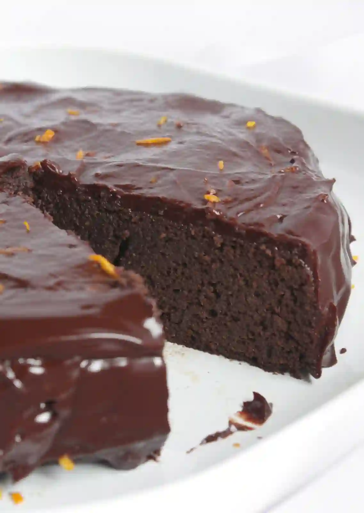

+++
title = "Cake Pinto Bean"
description = ''
updated = 1648304986198
created = 1648304986198
date = '2022-03-26'
+++

## Ingredients

- 1 cup white sugar
- ¼ cup butter
- 1 egg 
- 2 cups cooked pinto beans, mashed
- 1 teaspoon vanilla extract
- 1 cup all-purpose flour 
- 1 teaspoon baking soda
- 1 cup golden raisins
- ½ teaspoon salt
- 1 teaspoon ground cinnamon
- ¼ teaspoon ground cloves
- ½ teaspoon ground allspice
- ½ cup chopped pecans
- 2 cups diced apple without peel

## Directions

1. Preheat oven to 375 degrees F (190 degrees C). Grease one 9 or 10 inch tube pan.

1. Cream butter or margarine and sugar together. Add the beaten egg and mix well. Stir in the mashed cooked beans and the vanilla.

1. Sift the flour, baking soda, salt, ground cinnamon, ground cloves, and ground allspice together. Add the chopped pecans, golden raisins, and the diced apples to the flour mixture. Stir to coat. Pour flour mixture into the creamed mixture and stir until just combined. Pour batter into the prepared pan.

1. Bake at 375 degrees F (190 degrees C) for 45 minutes. Dribble with a simple confectioner's sugar icing and garnish with candied cherries and pecan halves, if desired.

## References
- <https://www.allrecipes.com/recipe/7706/pinto-bean-cake/>
