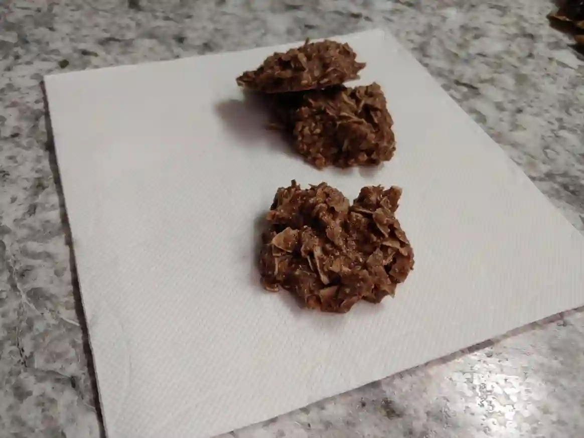

+++
title = "Cookie - Chocolate No-Bake"
description = 'Cookies, peanut butter, cacao butter, chocolate, coconut'
date = "2022-08-06"
tags = [
    "keto",
    "keto-ratio"
]
thumbnail = "./cookie-choco-peanut-no-bake.webp"
+++

| fat 85% | protein 7% | net carbs 9% |

Cookies, peanut butter, cacao butter, chocolate, coconut

## Quick info
- 1 serving, 1 cookie (91.2 kcal)

    | macro | ratio | grams | calories |
    | ---  | --- | --- | --- |
    | fat | 85% | 8.6g | 77 kcal |
    | protein | 7% | 1.5g | 6.0 kcal |
    | total carbs | - | - | - |
    | fiber | - | - | - |
    | net carbs | 9% | 2g | 8 kcal |
- 30 cookies

## Ingredients (wet)
- 112g cacao butter
- 120g peanut butter

## Ingredients (dry)
- 48g inulin
- 20g cacao powder
- 80g tiger nuts
- 100g coconut flakes (unsweetened)

## Directions
1. melt cacao butter in a microwave or on stovetop, only enough to be liquid
1. mix peanut butter into cacao butter
1. set pb and cacao butter mixture aside
1. in a new bowl, mix dry ingredients (__except coconut flakes__)
1. combine dry with wet ingredients
1. wax paper or cling wrap to cover tray or plate (for non-stick)
1. spoon onto wax paper
1. set somewhere cool to set

## Variations
- shredded coconut flakes
- vary quantities as desired
- substitute cocoa powder with cinnamon, ginger, nutmeg?